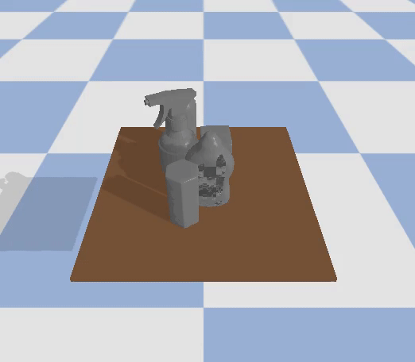

# Power Push-Grasping

Power Push-Grasping (PPG) is a method for planning multi-fingered power grasps in dense clutter. Specifically, robot agents are trained in order to create enough space for the fingers to
wrap around the target object to perform a stable power grasp, using a single primitive action.

This repository provides PyTorch code for training and testing PPG policies in simulation with a Barrett Hand. This is the reference implementation for the paper: 'Learning Push-Grasping in Dense Clutter'.

## Citing
If you find this code useful in your work, please consider citing:
```shell

```

## Installation
```shell
git clone git@github.com:mkiatos/power-push-grasping.git
cd power-push-grasping

virtualenv ./venv --python=python3
source ./venv/bin/activate
pip install -e .
```

In this implementation PytTorch 1.9.0 was used:
```shell
pip install torch==1.9.0+cu111 torchvision==0.10.0+cu111 torchaudio==0.9.0 -f https://download.pytorch.org/whl/cu111/torch_stable.html
```

## A Quick-Start: Demo in Simulation

[//]: # ()

[//]: # ()

<p align="center">
  
   
   
</p>


This demo runs our pre-trained model with a Barrett Hand in simulation on an environment. The objective is
to perform a stable graspr. The video on the left visualizes the PPG policy on seen objects while the video on the right
visualizes the performance of the PPG policy on challenging scenes. To run a quick demo follow the instructions.

Download the pretrained models.
```commandline
cd downloads
./download-weights.sh
cd ..
```

Then, run the following command.
```commandline
python test.py --fcn_model 'downloads/fcn_model.pt' --reg_model 'downloads/reg_model.pt' --seed 6 --n_scenes 10
```


## Dataset
Collect training data (saved locally).
```commandline
python collect_data.py --singulation_condition --n_samples 10000 --seed 1
```
If you want to collect data without the singulation condition (as described in the paper).
```commandline
python collect_data.py --n_samples 10000 --seed 1
```

## Training
To train the FCN model for predicting the position and orientation:
```commandline
python train.py --dataset_dir path_to_dataset --module 'fcn' --epochs 100 --batch_size 1 --lr 0.0001
```

To train the Aperture-CNN regression module:
```commandline
python train.py --dataset_dir path_to_dataset --module 'reg' --epochs 100 --batch_size 4 --lr 0.0001
```

## Evaluation
To evaluate your own models just replace the snapshot. If you want to check the performance on unseen object set, just change the argument to --object_set 'unseen':
```commandline
python test.py --fcn_model path-to-fcn-model --reg_model path-to-reg-model --object_set 'seen' --n_scenes 100 --seed 0
```

To evaluate on challenging scenes.
```commandline
python test.py --fcn_model path-to-fcn-model --reg_model path-to-reg-model --object_set 'challenging'
```